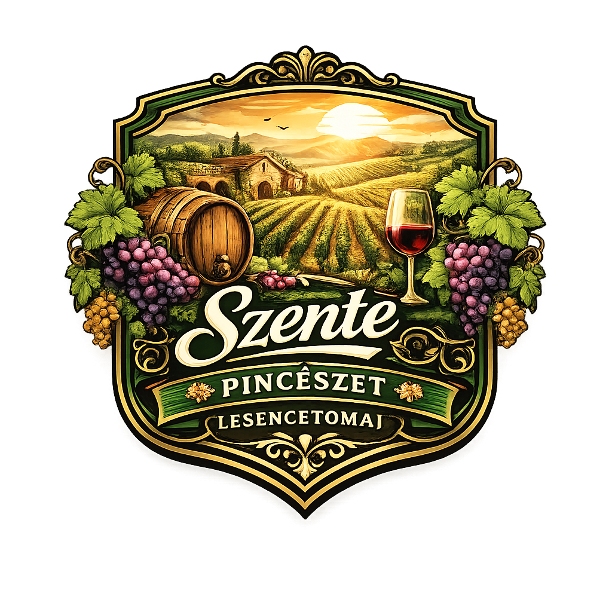

  

# vizsgaremek
Szoftverfejlesztő és tesztelő záróvizsga remeke.
Résztvevők: Sinthavong Bence és Szente Benedek Rafael

## Vizsgaremek célkitűzése

A vizsgaremek célja egy borászatot bemutató és borértékesítést támogató webalkalmazás elkészítése, amely lehetőséget ad a felhasználóknak borok böngészésére, rendelés leadására, valamint borászati programokra / kóstolókra történő foglalásra.  
Az alkalmazás felhasználóbarát felületet biztosít a vásárlóknak, és egy adminisztrációs oldalt a borászat számára a termékek és rendelések kezeléséhez.

## Feladat leírása, bemutatása

Az alkalmazás egy magán borászat számára készül, amelynek célja az online jelenlét erősítése és a vásárlási folyamat digitalizálása.  
A webalkalmazás fő funkciói:

- a borászat és a borok bemutatása (leírás, ár, kategória, évjárat, készlet)
- online rendelés és rendeléskezelés
- foglalások kezelése (például borkóstoló, pincelátogatás)
- regisztráció/bejelentkezés, jogosultságkezelés (felhasználó vs. admin)
- admin oldalon termékek, rendelések és foglalások kezelése

## Tervezett vállalásaim

### Frontend

#### Felhasználókezelés
- regisztráció, bejelentkezés, kijelentkezés
- profil adatok megtekintése / módosítása

#### Borok megjelenítése
- borlista szűréssel (szőlőfajta, ár, típus, évjárat)
- bor részletes oldal (leírás, készlet, ár)

#### Bor rendelés
- kosár funkció
- rendelés leadása
- rendelési státusz megjelenítése (pl. feldolgozás alatt, kiszállítva)

#### Foglalások
- elérhető időpontok megtekintése
- foglalás rögzítése és lemondása
- foglalások listázása a felhasználónak

### Backend

#### Backend kiszolgáló kialakítása
- REST API végpontok a frontend kiszolgálására
- hitelesítés és jogosultságkezelés (pl. JWT token)

#### Technológiai vállalás
- Node.js / ASP.NET alapú kiszolgáló (attól függően melyiket választod a végén)
- naplózás és hibakezelés

## Adatbázistervezés

A rendszerhez relációs adatbázis készül (pl. MySQL), amely tartalmazza többek között az alábbi táblákat:

- users (felhasználók, szerepkörök)
- ugyfel/profil (név, telefonszám, cím)
- borok (név, típus, évjárat, ár, készlet)
- rendelesek (felhasználó, dátum, összeg, státusz)
- rendeles_tetelek (melyik bor, mennyiség, egységár)
- foglalasok (felhasználó, dátum/idő, szolgáltatás, megjegyzés)

Az adatbázis célja, hogy biztosítsa:

- az adatok következetességét (kulcsok, kapcsolatok)
- a gyors lekérdezhetőséget (indexek, normalizálás)
- a későbbi bővíthetőséget

## Tesztelés

A projektben mind backend, mind frontend oldali tesztek készülnek, hogy a működés megbízható legyen.

### Backend tesztek
- egységtesztek és integrációs tesztek (pl. NUNIT, ha ASP.NET; Node esetén Jest/Mocha)
- API végpontok helyes működésének ellenőrzése
- adatbázis műveletek tesztelése

### Frontend tesztek
- automatizált UI tesztek Selenium segítségével
- alap funkciók tesztelése: regisztráció, belépés, kosár, rendelés, foglalás

